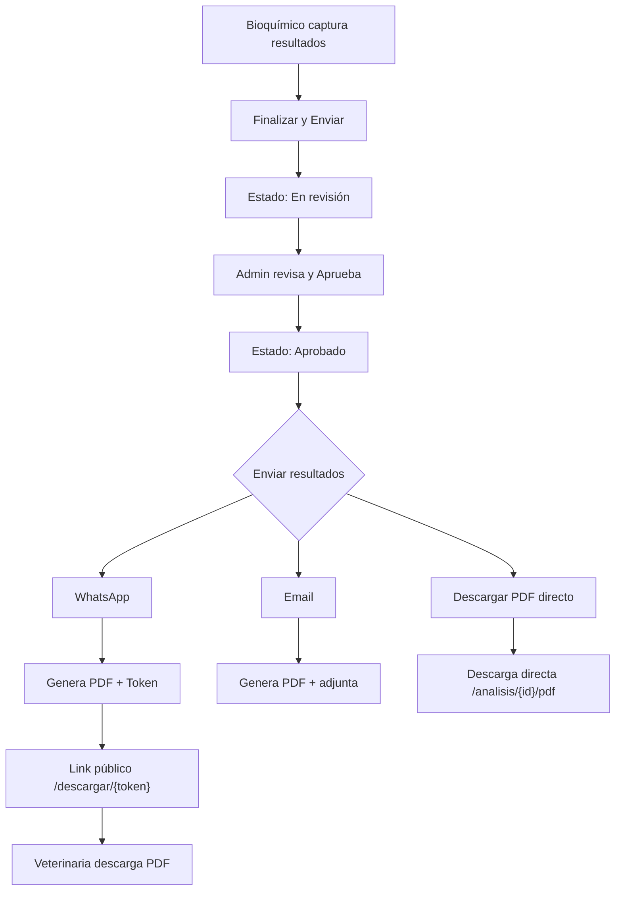
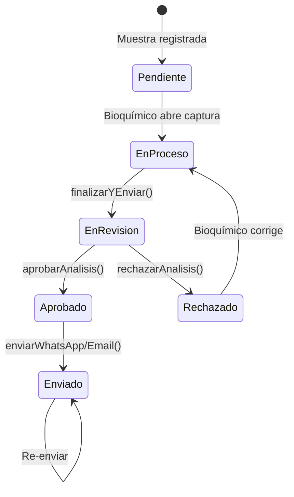

# Flujo Completo: Resultados → PDF → Envío → Descarga

## Diagrama General



---

## 1. Captura y Envío de Resultados

**Archivo:** [CapturarResultados.php](file:///f:/JHOEL/SEMESTRE%202-2025/LABVET/labvet/app/Livewire/Resultados/CapturarResultados.php)

### `finalizarYEnviar()` (línea 271)

1. Si es modo edición, elimina resultados anteriores (preservando imágenes que se mantienen)
2. Recorre todos los componentes dinámicos de la plantilla
3. Para cada componente:
   - Si es `campo-imagenes`: sube las imágenes a `storage/analisis/imagenes/` y guarda las rutas
   - Otros tipos: filtra datos vacíos y guarda el JSON en la tabla `resultados`
4. Crea registros `Resultado::create()` con: `analisis_id`, `tipo`, `valor` (JSON), `fuera_rango`
5. Actualiza el estado del análisis a **"En revisión"** y registra `fecha_finalizacion`
6. Redirige al bioquímico de vuelta

### `aprobarAnalisis()` (línea 481)

1. Guarda cualquier cambio pendiente en resultados (`guardarResultadosInterno()`)
2. Actualiza el análisis:
   - `estado` → **"Aprobado"**
   - `aprobador_id` → ID del admin actual
   - `fecha_aprobacion` → timestamp actual
3. Redirige a la vista de revisión

> [!IMPORTANT]  
> **Solo los análisis con estado "Aprobado" pueden generar PDFs.** Este es el requisito obligatorio.

---

## 2. Generación del PDF

**Archivo:** [AnalisisPdfService.php](file:///f:/JHOEL/SEMESTRE%202-2025/LABVET/labvet/app/Services/AnalisisPdfService.php)

### `generar(Analisis $analisis)` (línea 13)

| Paso | Descripción |
|------|------------|
| 1 | Valida que el análisis esté en estado **"Aprobado"** |
| 2 | Carga relaciones: muestra, especie, veterinaria, sucursal, plantilla, bioquímico, aprobador, resultados |
| 3 | Busca la plantilla asignada al análisis, o usa la plantilla activa del tipo de análisis |
| 4 | Prepara datos con `prepararDatos()` |
| 5 | Genera el PDF con **DomPDF** usando la vista `pdf.analisis` |
| 6 | Configura papel **Letter**, orientación **Portrait** |
| 7 | Guarda el archivo en `storage/app/public/pdfs/YYYY/MM/nombre.pdf` |
| 8 | Registra en la tabla `pdfs`: ruta, generado_por, fecha |

### `prepararDatos()` (línea 89)

- Agrupa los resultados por tipo de componente
- Para cada componente de la plantilla, busca su resultado correspondiente
- Si existe una gráfica guardada (`charts/{analisisId}_{index}.png`), la convierte a Base64
- Carga imágenes de fondo (`FONDO-HOJA.png`) y firma (`firma-sin_fondo.png`) como Base64

### `descargarDirecto()` (línea 156)

- Llama a `generar()` internamente
- Retorna la descarga directa al navegador (sin guardar token)

---

## 3. Rutas del PDF

**Archivo:** [web.php](file:///f:/JHOEL/SEMESTRE%202-2025/LABVET/labvet/routes/web.php)

| Ruta | Método | Controlador | Descripción |
|------|--------|-------------|-------------|
| `/analisis/{id}/pdf` | GET | `PdfController@descargar` | Descarga directa (requiere auth) |
| `/descargar/{token}` | GET | `PdfController@descargarPorToken` | Descarga pública por token |
| `/analisis/{id}/guardar-grafica` | POST | `PdfController@guardarGrafica` | Guarda imagen de gráfica |

---

## 4. Link de Descarga Pública (Token)

**Archivo:** [TokenDescarga.php](file:///f:/JHOEL/SEMESTRE%202-2025/LABVET/labvet/app/Models/TokenDescarga.php)

### Creación del token

```php
$tokenDescarga = TokenDescarga::crearParaPdf($pdf->id, 3); // 3 días de validez
$urlDescarga = $tokenDescarga->getUrlDescarga(); 
// Resultado: https://tudominio.com/descargar/abc123...xyz (64 caracteres aleatorios)
```

### Estructura del token

| Campo | Valor |
|-------|-------|
| `pdf_id` | ID del PDF en la tabla `pdfs` |
| `token` | String aleatorio de 64 caracteres (`Str::random(64)`) |
| `fecha_expiracion` | 3 días desde la creación |
| `usado` | `false` (no se marca como usado, se usa límite de descargas) |

### Validación al descargar (`descargarPorToken`)

1. Busca un token válido: no expirado (`fecha_expiracion > now()`) y no usado
2. Carga el PDF asociado y su análisis
3. Si el archivo no existe en storage, **lo regenera automáticamente**
4. Verifica límite de descargas: **máximo 10 descargas por token**
5. Registra un `LogDescarga` (IP, fecha)
6. Retorna el archivo PDF

---

## 5. Envío de Resultados

**Archivo:** [GestionarMuestras.php](file:///f:/JHOEL/SEMESTRE%202-2025/LABVET/labvet/app/Livewire/Muestras/GestionarMuestras.php)

### WhatsApp Individual (`enviarWhatsApp`, línea 204)

1. Valida estado: debe ser **Aprobado** o **Enviado**
2. Verifica teléfono de la veterinaria
3. Obtiene el PDF existente o lo genera con `AnalisisPdfService`
4. Crea un `TokenDescarga` (válido 3 días)
5. Construye mensaje con datos del paciente + link de descarga
6. Abre `wa.me/{telefono}?text={mensaje}` en nueva pestaña
7. Cambia estado del análisis a **"Enviado"**

### WhatsApp Múltiple (`enviarTodoWhatsApp`, línea 284)

- Mismo flujo pero genera un token por cada análisis de la muestra
- Construye un mensaje consolidado con todos los links

### Email Individual (`enviarEmail`, línea 371)

1. Valida estado y verifica email de la veterinaria
2. Genera el PDF si no existe
3. Envía email con `ResultadosAnalisisMail` (PDF adjunto)
4. Cambia estado a **"Enviado"**

### Email Múltiple (`enviarTodoEmail`, línea 441)

- Genera PDFs para todos los análisis
- Envía un solo email con todos los PDFs adjuntos

---

## 6. Ciclo de Estados del Análisis



---

## 7. Modelos Involucrados

| Modelo | Tabla | Relación |
|--------|-------|----------|
| `Analisis` | `analisis` | Pertenece a `Muestra`, tiene muchos `Resultado` y `Pdf` |
| `Resultado` | `resultados` | Pertenece a `Analisis`, almacena datos JSON por componente |
| `Pdf` | `pdfs` | Pertenece a `Analisis`, tiene muchos `TokenDescarga` |
| `TokenDescarga` | `tokens_descarga` | Pertenece a `Pdf`, tiene muchos `LogDescarga` |
| `LogDescarga` | `logs_descarga` | Pertenece a `TokenDescarga`, registra IP y fecha |
